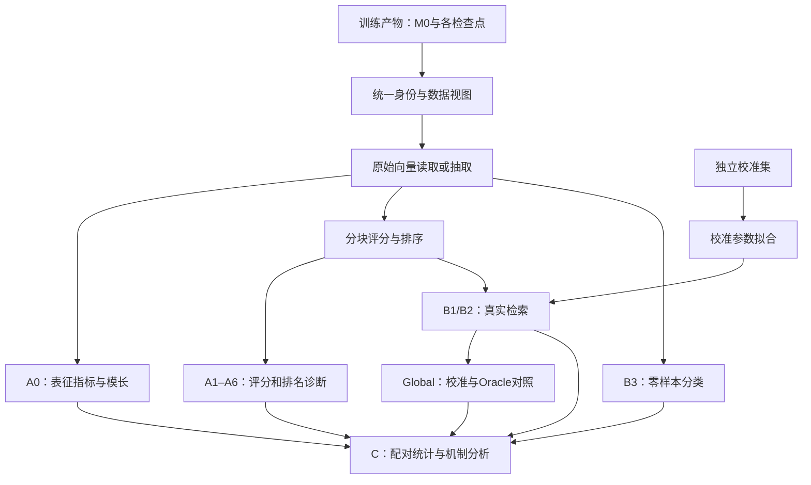

# A/B/C正式实验实现框架设计

**状态更新（2026-09-28）：训练已暂停，已完成实验和下一轮决策以[当前实验状态](../training/CURRENT_EXPERIMENT_STATUS.md)为准。下一轮恢复九分支并计划五轮，但新配置、81项矩阵及滚动保存尚未实施。下文中的旧轮数、FN取消、79项矩阵和“当前运行”均属于当时协议记录，不是新机器的自动执行计划。**

状态：2026-09-22已实现A0–A6、MMEB十二项Local及B1 COCO/Flickr30K双向检索，正式全轨迹入口见[B1及正式队列说明](B1_FORMAL_RUNBOOK.md)。B3、Global及校准/Oracle代码已在独立扩展包实现；C1/C2已实现、C3仅整理链路数据。按用户最新确认，C先写代码、等全部A/B结束后再运行，详见[扩展说明](EXTENDED_BC_RUNBOOK.md)。

2026-09-22执行状态：数据盘已扩为300 GiB。24项20%诊断、72份轨迹校验和225个评测子任务全部完成；诊断权重按用户单独授权退役，日志、raw向量和评测数组保留，来源见`outputs/archives/p020_diagnostics_20260922/`。完整正式训练已使用独立输出配置在后台运行。Global代码已实现，大库准备与全量执行仍暂缓。后续正式产物如需周转，继续遵守归档来源清单和回读SHA校验要求；网盘接入及自动化尚未实现。

目的：把已确认的研究协议映射到代码，形成可追溯、可复用的评测链路。下文保留整个研究范围；当前可执行范围以诊断运行手册为准。固定温度0.1、Top-K=[1,5,10]、统一候选池及逐样本Norm Dynamics已获确认。旧20%诊断已结束；旧正式队列为单seed一轮；当前接续计划以文首两轮说明为准。

## 1. 总体结构

采用“共享输入和计算基础，分开回答研究问题”的结构。训练只负责产生权重、训练日志和来源信息；A/B/C评测不更新训练参数。



同一份向量服务多个指标；同一评测视图下的评分尽量一次计算、多种统计共同消费。共享模型权重不代表不同任务的输入向量可无条件复用：文本模板、查询/候选角色、图像预处理不同时，必须具有不同的缓存身份。

## 2. 现有代码如何利用

| 现有代码 | 实施方式 |
|---|---|
| `src/model_adapters/` | 复用CLIP/BEiT-3/VISTA/ALBEF加载和编码接口；明确模型能力，不使用“有方法名就猜支持”的判断 |
| `src/evaluation/trajectory.py` | 复用权重来源检查和加载；扩展对已保存的部分轨迹的读取 |
| `src/evaluation/embedding_export.py`、`src/embeddings/artifact.py` | 复用raw float32导出与SHA；增加按角色的IT、数据子集和大规模分片支持 |
| `src/metrics/representation_metrics.py` | 两端一致的八指标实现基线；扩展新的Norm Dynamics，保留不变指标的数学定义 |
| 先验归档内`scripts/evaluation/mmeb_retrieval.py` | 后续提取数据读取与已核对的输入处理为可测试函数，补任务身份、相关答案集合与逐查询结果；当前不再提供旧脚本入口 |
| 先验归档内`scripts/analysis/mmeb_group_summary.py` | 后续保留6/5/1分组；分支和seed从元数据读取，不再通过旧run名称后缀猜测 |
| 先验归档内`scripts/evaluation/mixed_retrieval.py` | 仅借鉴池构造和排名实现；其自建检索结果不作为正式B类证据 |

本地与服务器使用同一套八指标公共算子，旧六指标实现已退出当前代码目录。先验专用入口与旧训练配置保存在`pilot_code_20260920.zip`，位置见[主README](../../README.md)。当前A/B诊断使用新的独立结果空间，复用已核对公式和MMEB输入规则，不恢复旧训练分支入口，不覆盖历史结果。

## 3. 先统一四种输入身份

### 3.1 模型检查点

`CheckpointRef`（检查点引用）至少包含：model、branch、seed、point、optimizer_step、checkpoint_sha256、训练协议SHA、来源run_manifest。

M0按模型与初始化SHA共享，不为42/43/44重复抽取。M0的seed字段为null；训练点的seed必须明确。训练任务默认使用42，完整主矩阵使用42/43/44，gate和VISTA Fixed-2M使用42。

### 3.2 数据视图

`DatasetView`（评测使用的样本集合）包含：样本ID及顺序、原始数据版本、split SHA、文本/图像内容身份、预处理和提示词规则、查询角色、候选角色。

`CandidatePool`（候选集合）和`RelevanceSet`（标注认可的答案集合）单独声明，不能把训练batch或训练正例索引直接当成下游评测定义。

COCO/Flickr的一图多描述、MMEB每查询候选列表、M-BEIR共享大库需要不同的数据读取方式，统一输出query_id、candidate_id、modality、relevant_ids。

### 3.3 评测视图

`EvaluationView`规定：使用raw还是cosine、池的范围、屏蔽规则、温度、并列分数处理、指标聚合方法。所有受比较分支使用相同视图，不能让FN-on模型和FN-off模型各用自己的训练分母接受评测。

明确区分三类数量：训练batch=36；A/B向量抽取批次可按资源设置；实际评测候选数由完整probe/基准协议定义。向量分批处理不能缩小候选池。训练过程Validation丢8条的规则不应用于A/B评测；A/B应覆盖完整规定样本，包括最后不足一批的样本。

### 3.4 产物与缓存

`ArtifactRef`包含文件SHA、样本顺序SHA、上述三类身份，以及相关评测代码SHA和模型外部源码版本。不能只依赖Git HEAD，因为当前存在未提交改动。

复用缓存前逐项核对身份；语义相同但路径迁移可以通过内容身份识别，模板/样本/权重/指标定义变化则生成新产物。不同seed、协议版本、校准状态的结果不得覆盖。

## 4. gate和M0是第一批必须解决的接口

### 4.1 支持20%暂停状态

原`load_completed_run_manifest()`仍只接受complete以保留旧接口语义；新增`load_evaluation_run_manifest()`接受paused/complete，`resolve_trajectory_snapshots(..., labels=...)`只解析明确请求且已经完成的点，避免要求尚未生成的p100。

扩展为按“请求检查点集合”读取已保存权重：gate请求M0/p001/p005/p020，允许训练状态paused；每个点仍校验实际文件和来源SHA。p050/p100标为not_requested，不伪装为缺失或complete；缺少已请求点则报错。评测完成只更新评测任务状态，不把训练状态改为complete。

### 4.2 COCO4407及其基线

以冻结COCO5000清单和确定版本的Karpathy test图像ID求差集；核对确实排除593、保留4407。按原图像ID比较，不能依赖可变化的路径字符串。保留原顺序并生成独立新manifest，记录父清单SHA、被排除ID和子集SHA；不修改原COCO5000清单。

已有M0 raw向量按ID选出4407行，无需重新运行编码器。新的指标和几何参考在新命名空间生成；旧5000条的有效秩、邻居和评分统计不能直接裁剪为4407条结果。新pair indices和邻居参考应在新子集上建立、冻结，并用于所有后续检查点。

LCS仍为10K。其不变指标可按已核对身份引用原基线；新Norm Dynamics等统计从原始向量派生到新命名空间，不覆写旧指标。

原32文件M0锚点保持不变；新派生产物建立自己的来源清单。不得因为新子集或新公式与旧标量不同，就改写旧M0来“对齐结果”。

## 5. 表示抽取及模型能力

| 模型 | I/T | IT | 额外注意 |
|---|---|---|---|
| CLIP/BEiT-3 | pre-L2 raw head输出 | raw I+T；评分时归一化 | 加法IT可由I/T按块重建，无须重复存整份矩阵 |
| VISTA | 评测适配器可提供raw | 原生encode_mm | 新正式A实验需要原生IT；不能用加法填补。旧先验取消导出的决定不等于新实验已有IT产物 |
| ALBEF | 原生ITC的I/T | 不人工构造 | 三模态向量诊断不自动适用；ITM重排属于单独的pair scorer（图文对打分器） |

VISTA评测为获取raw可能设置normlized=False，原生实现会连带修改内部temperature。A6的native温度必须取训练配置中的真实0.02；不能将这种导出副作用误当成模型训练温度。CLIP/BEiT-3使用对应检查点的logit_scale。

对需要IT但模型没有已定义接口的任务，计划阶段明确unsupported及原因，不静默换成I+T，也不把缺失指标填0参与平均。ALBEF适用任务与重排范围需按其独立协议声明。

## 6. A类：从表示到评分、排序

### A0 表征与模长

复用centroid、covariance、effective rank、alignment、geometry preservation、score gap、anisotropy的已有核对公式；遵守raw/L2主辅口径。保留原字段含义：现有cross_modal_alignment是归一化向量距离，越小越接近；matched_pair_cosine是余弦，越大越接近，展示时不能混用方向。

新增逐样本Norm Dynamics：保存image_norm、text_norm、r_i=log(image_norm/text_norm)，再汇总mean/median/std。旧`abs(log(mean_norm_I/mean_norm_T))`不是同一统计，不改名冒充新指标。

保存additive模型的D_IT=cos(I,IT)-cos(T,IT)，以及paired cosine，便于区分模长和夹角作用；D_IT是诊断量，不称为第九个gap。零模长导致比值或方向未定义时显式报错/记录，不用隐含epsilon改变实验意义。

已确认先逐样本计算`Delta_out_i=sign(r_M0_i)*(r_t_i-r_M0_i)`，再汇总mean/median/std，样本标准差ddof=1；逐样本原料同时保留。

### A1–A6共享评分核心

| 模块 | 消费内容 | 主要产物 |
|---|---|---|
| A1 正负分布 | I/T/IT六方向分数与答案身份 | 正负分布摘要、固定采样分布数据、样本数 |
| A2 评分可比性 | 同一query对不同模态的背景分布 | 按query的W1（分布距离）、有符号均值偏移及汇总 |
| A3 困难负例间隔 | 两个同实例相关表示、真正错误候选 | M_first、M_all、负间隔比例、最强错误候选模态 |
| A4 正例排名 | 完整统一池内六方向目标 | 逐query排名、分位数及汇总 |
| A5 模态偏置 | Top-K、候选模态和实际先验比例 | P_m@K、P_m@K-pi_m、排除相关项后的background bias |
| A6 方向概率/CE | 固定分母视图和温度 | 六方向概率/CE的mean、median；fixed/native温度分别记录 |

A3中query为I时，同实例T和IT可同时作为两个相关答案；计算最强错误候选h时两者都应排除。训练FN-on曾将第三表示当作竞争者，不会改变评测的相关性定义。具体错误候选按清单或基准标注定义。

A2按query计算的W1不能用旧A0混合所有query的总体W1替代。当前A4采用严格更大分数计数加1并另存悲观rank；A5采用K=1/5/10及边界并列按比例分摊；A6固定温度0.1并辅以原生温度。A4/A6统一3N池仅屏蔽query自身，A3和A5背景范围排除全部同实例表示。

分块核心对每个评分块更新多个消费者：log-sum-exp（稳定计算softmax分母）、Top-K、正例排名、最强负例、按模态统计。需要精确分布/中位数时可保留一批query的完整候选分数或逐query标量；不能用近似直方图冒充精确W1。原始完整N×N分数矩阵不作为默认落盘产物。

step-1低温诊断独立记录。现有第一步日志是第一次更新前的前向，不能称为“更新一步后的检查点”。若使用M0复现首个训练批次，需复用同seed的数据/增强/模型随机规则并标为pre_update_step_1；若要求更新后的权重，则需后续补保存接口。该诊断不触发训练pass/fail。

## 7. B类：统一检索器，保留基准差异

### B1 传统检索

已实现：COCO Karpathy Test保留5000张图片、全部25010条描述（用户确认）；Flickr30K保留1000张图片、5000条原始描述。二者分别读取自己的查询、候选及多正例标注；同一图片对应的多条描述都应被识别。分别报告I→T和T→I的R@1/5/10，mR为双向R@1/5/10六个比例的算术均值。B1并列按原始候选索引固定排序；既有A/Local口径不改。不要复用probe中“每图一条caption”的相关性规则。

### B2 Local与Global（Global延后执行）

Local保留每个任务的原生query/candidate组合和候选范围。MMEB现有实现的每查询1000候选及首项为正例，只能在该数据版本核对后转换为明确relevant_ids，不能推广到所有基准。保留输入模板/文本处理的明确模式，禁止通过测试集的表现选择模式。

MMEB继续报告12任务总体、cross-modal六任务、mixed-composite五任务和NIGHTS。新代码根据model/branch/seed/point字段分组；缺任务时不生成看似完整的12任务均值。

Global使用M-BEIR规定的共享候选库，候选ID及模态身份贯穿所有分块。先实现精确分块检索作为参考；近似最近邻检索若以后需要，另设协议和误差审计。旧自建mixed retrieval不进入正式B类。

ALBEF的ITC召回→ITM重排作为显式能力独立接入，不与余弦结果混为一列；重排top-k、适用任务、最终打分方式尚需声明。当前没有定义的ALBEF人工IT路径不能沿用先验MMEB的加法兜底。

### B3 零样本分类

ImageNet-1K已固定官方CLIP 80模板和1000类名：每模板向量先归一化、按类平均、最后再次归一化。图像分批与全部类别比较，报告Top1/Top5；不从测试准确率选择模板。

### Global评分校准与Oracle（延后执行）

校准集与测试查询分开，所有分支使用同一划分；每个模型/检查点独立拟合偏移，保存calibration_id和拟合来源。raw、calibrated、oracle使用相同基础候选、查询与标注，只有明确的评分或候选限制干预不同。

已确认mu按查询所属任务×候选模态估计：独立验证查询各自对该模态非相关候选取平均，再按任务对查询等权平均；不用测试query_id拟合偏移。

主比较保存Gap_raw、Gap_cal及Gap_cal-Gap_raw，同时保存两者绝对值；差距是否缩小不能仅凭最后一项的正负判断。校准不能被解释为精确分解全部语义损失。Oracle使用答案模态信息，必须标为诊断参考；已确认多正确答案时保留其模态并集，不报告为实际系统方法。

## 8. C类与M0跨模型分析

C只读取已完成且身份一致的A/B结果，不再次加载模型。

- C1：同模型、同seed、同任务/点/评测视图配对，先计算每seed的差值，再报告平均及种子变动；缺配对则报incomplete。已确认使用配对seed差值的95% Student-t区间，明确小样本近似；单seed无CI，不能把query或checkpoint当额外seed。
- C2：比较变化方向、分支排序和相对M0的变化；已确认使用直接差值Delta M=M_current−M0，不除以M0。绝对值作背景。
- C3：按模型分层保留regime干预、seed重复和checkpoint序列的依赖关系，本轮仅整理A→评分→排名→B的链路数据，不进行相关性、显著性或因果拟合；方法后定。
- M0辅助：RSA-Spearman、linear CKA、谱/有效秩、各向异性和邻居重叠使用同一数据视图、同一模态及对齐样本。不同模型维数可不同，样本对应不能不同；不比较未经对齐的特征坐标。

机制箭头是要检验的路径。FN屏蔽、评分校准等干预与跨时间关联分别记录证据类型，避免相关性自动升级为因果结论。

## 9. 模块与后续接口

当前另已落地`b1_retrieval.py`、`run_formal_queue.py`及`formal_ab.yaml`，覆盖B1与正式全轨迹调度。当前已落地`protocol.py`、`probe_views.py`、`gpu_encoding.py`、`score_analysis.py`、`representation_analysis.py`、`retrieval.py`、`diagnostic_runner.py`和`run_diagnostics.py`。下表保留完整研究框架的后续接口规划，新增`src/evaluation/extended/`提供classification、global_retrieval、global_runner、mbeir_data、vector_store；`src/analysis/`提供C统计与结果读取，独立入口为run_extended.py/analyze_formal.py。下表按当前真实路径列出。

| 当前模块 / 入口 | 职责 |
|---|---|
| `src/evaluation/protocol.py` | 四类身份、任务计划、能力/缺参校验 |
| 现有`trajectory.py` | 已完成和部分轨迹的只读解析 |
| 现有`embedding_export.py`、`embeddings/artifact.py` | raw I/T/IT读取、抽取、子集与分片缓存 |
| 现有`metrics/representation_metrics.py` | A0及Norm Dynamics；先从服务器迁移已有正确实现 |
| `src/evaluation/score_analysis.py`、`extended/global_retrieval.py` | A评分统计及Global精确分块排名 |
| `src/evaluation/score_analysis.py` | A1–A6统计消费者 |
| `src/evaluation/retrieval.py`、`b1_retrieval.py`、`extended/classification.py` | Local、B1与B3类别向量/分类 |
| `src/evaluation/extended/global_retrieval.py`、`global_runner.py` | 独立验证校准、干预身份、Oracle |
| `src/analysis/formal_statistics.py`、`result_inputs.py` | C1/C2统计、C3数据与完整结果范围校验；M0额外RSA/CKA支线另行接入 |
| `scripts/evaluation/run_formal_queue.py`、`run_extended.py` | 现有A/B1/Local队列与独立B3/Global入口 |
| `scripts/analysis/analyze_formal.py` | 从结果索引执行C类与论文表图生成 |

核心接口示意：`resolve_points(run_ref, requested_points)` → `ensure_embeddings(checkpoint, dataset_view, roles)` → `score_blocks(queries, candidates, evaluation_view)` → 各指标消费者 → `write_result(result_ref)`。B2校准先显式fit，再apply；C只consume结果。

## 10. 产物布局与规模控制

当前诊断实际使用`outputs/evaluation/ab_diagnostic_v1/`，布局见运行手册；完整后续实验的拟议命名空间为：

```text
outputs/evaluation/formal_v1/
  baselines/<model>/<dataset_view_sha>/
  embeddings/<checkpoint_sha>/<input_view_sha>/
  results/<run_id>/<point>/<task>/<evaluation_view_sha>/
    summary.json
    per_query.jsonl.gz
    provenance.json
  calibration/<calibration_id>/
  statistics/<analysis_spec_sha>/
  index.json
```

保留现有小规模NPZ读取能力；大候选库采用分片NPY或块读取，避免先拼成一个巨型内存数组。A类raw向量是研究主产物，完整保留，可在已校验的网盘归档中保存，不要求全部常驻服务器。单项任务完成评测并成功回读校验归档后，才清理对应的大文件副本；上传失败、校验失败或评测未完成时保留原件。日志、指标和来源/归档索引常驻。后续大规模B候选向量是否持久缓存需单独确定，不由本轮Local阶段替Global作保留决策。

预算按清单实际N、维度d、dtype计算，例如一百万条768维float32约3.07GB，仅为一份向量矩阵；计划应列出整个执行范围的磁盘需求。推理批次和评分块大小是资源设置，不改变完整候选集。

逐查询和汇总结果至少带：eval_id、model、branch、seed、point、step、checkpoint_sha、dataset/split_sha、candidate_pool_sha、relevance_sha、representation_definition、metric_schema、evaluation_view_sha、temperature_mode、calibration_id、metric、value、sample_count、status及reason。

同一eval_id写完才原子标记complete；中断产物标partial，重启按身份恢复。汇总从结果索引生成，不通过目录glob碰到一个文件就算完成；图表记录输入SHA，防止出现“原始结果齐全但汇总漏了ALBEF”的旧问题。

## 11. 实施顺序与验收

1. **迁移与身份基础**：对齐服务器八指标修复、部分轨迹读取、COCO4407派生清单和M0参考。验收：旧冻结文件不变，子集ID/顺序正确，gate可只读p020前缀。
2. **先完成gate需要的A0**：按新模长规则补原料与指标。验收：同权重自比结果正确，raw/L2含义不混淆，分支/seed不串表。此步是正式gate判读的前置条件。
3. **共享评分与A1–A6**：先小型人工候选集验证答案、FN屏蔽独立性、并列排名、W1、CE，再验证不同分块给出一致结果。
4. **B1/B2 Local与B3**：逐个基准核对原生相关性和模板；多正例、最后尾批、缺任务汇总均有检查。
5. **B2 Global及干预（暂缓）**：待训练和Local评测完成后，重新核算300 GB下的数据分阶段周转，再确定执行安排。其定义仍为先小库精确检索对照，再扩大共享库；校准划分无泄漏，raw/calibrated/oracle除干预外输入一致。
6. **C和M0辅助（C暂缓）**：待训练与A/B结果齐备后开展配对种子、缺失结果、依赖层级与统计口径检查；论文表图从版本化结果统一生成。

当前A0–A6与MMEB Local诊断参数已明确，加法模型的首批低温辅助诊断有独立入口。已冻结B3模板、Global校准和Oracle规则、C1区间与C2差值；后续还需完整数据/大规模验收、ALBEF独立重排范围以及C3统计方法。不重新定义已确认的训练batch、seed或FN开关。

当前用户已授权实现并加入B1正式评测队列；A/B1/Local接入五个轨迹点，B3/Global/C代码已独立实现，完整执行继续暂缓，C3仅导出数据。训练代码、训练配置、冻结probe及原M0文件保持不变。
